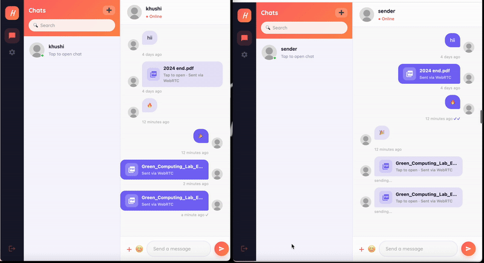
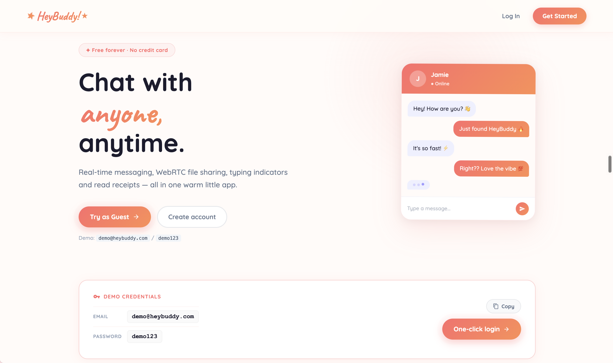
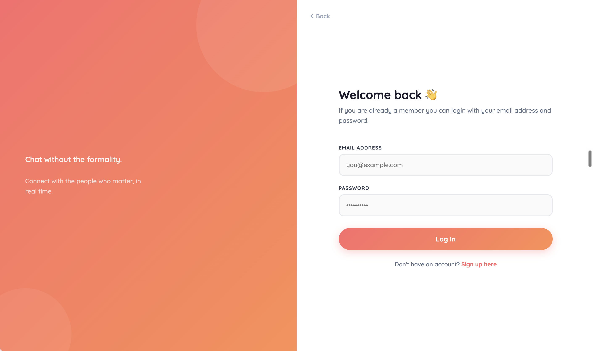
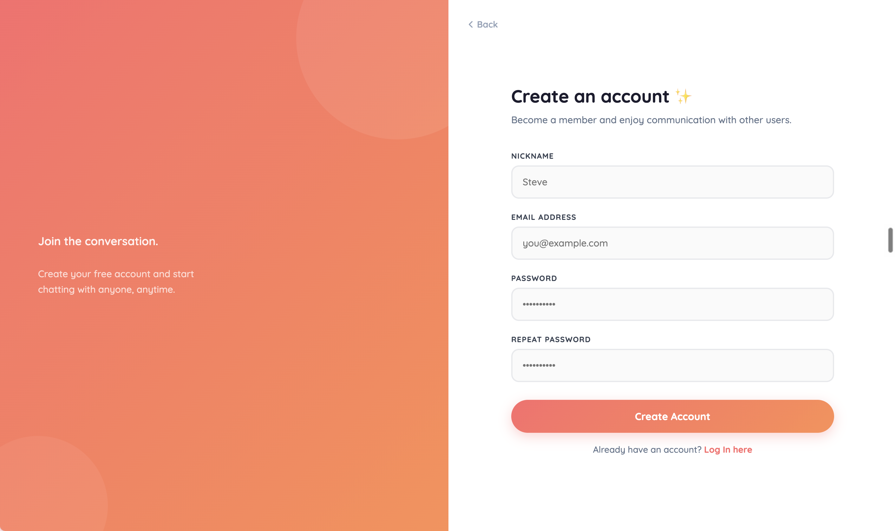
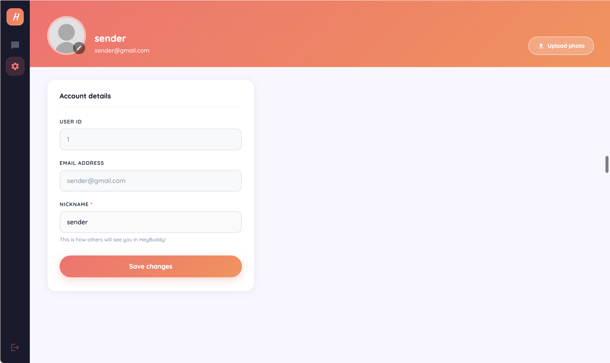

# HeyBuddy! 💬

A real-time chat application with **peer-to-peer PDF/document sharing over WebRTC** — built with Node.js, Express, React, and Socket.IO.

**🔗 Live demo:** https://truthful-vision-production-8931.up.railway.app/

> This project was originally forked from [Bioneisme/nodejs-socket-react-chatapp](https://github.com/Bioneisme/nodejs-socket-react-chatapp) (MIT licensed) and has been substantially redesigned and extended — see [What I Changed](#what-i-changed) below.

---

## 📄 Headline Feature: WebRTC PDF Transfer

HeyBuddy lets users send PDF documents **directly peer-to-peer** using WebRTC data channels — no file ever passes through or gets stored on the server. Socket.IO is used only to negotiate the WebRTC connection (signaling); the actual file transfer happens client-to-client.



_Live demo: sending a PDF between two users — the transfer happens directly peer-to-peer over WebRTC._

---

## Screenshots

**Landing page**


**Login**


**Sign up**


**Account settings**


---

## Features

- 📄 **Peer-to-peer PDF/document sharing via WebRTC** (headline feature)
- 💬 Real-time messaging with Socket.IO
- 🟢 Real-time online/offline presence
- ⌨️ Typing indicators
- ✓ Read receipts
- 🔐 Local authentication using email and password
- 👤 Account management — update profile details and avatar
- 🐘 PostgreSQL database with Sequelize ORM
- ☁️ Image storage via Cloudinary
- 🧠 Session management with Redis
- 🎨 Custom-designed UI with animations
- 🐳 Fully Dockerized setup

## What I Changed

Starting from the original chat app boilerplate, I:

- **Implemented peer-to-peer PDF/document transfer using WebRTC data channels** — the base project had no file-sharing capability at all; this was built from scratch, including the signaling flow over Socket.IO and the client-side WebRTC connection handling
- **Deployed the app live to Railway** — the original project was never deployed anywhere; I set up production Docker configuration, environment variables, and hosted services (Postgres, Redis, Cloudinary) to get it running publicly
- Redesigned the entire frontend UI — new color theme, layout, and animations
- Added real-time **online/offline presence** indicators
- Added **typing indicators**
- Added **read receipts**
- Integrated **Cloudinary** for avatar and image uploads
- Added **Redis** for session management
- Migrated state management to **Redux Toolkit**


## Tech Stack

| Layer    | Technology                      |
| -------- | -------------------------------- |
| Frontend | React, Redux Toolkit, Socket.IO |
| Backend  | Node.js, Express, Sequelize     |
| Database | PostgreSQL, Redis                |
| Realtime | Socket.IO, WebRTC                |
| Storage  | Cloudinary                       |
| DevOps   | Docker, Docker Compose           |

## Getting Started

### Prerequisites

- Node.js & NPM
- PostgreSQL
- Redis
- Cloudinary account

### Installation

```bash
# Clone the repository
git clone https://github.com/kajalnsut2500-m/HeyBuddy-.git
cd HeyBuddy-
```

```bash
# Install dependencies for each service
cd client && npm install
cd ../socket && npm install
cd ../server && npm install
```

Set up environment variables — copy `.env.example` to `.env` in the `server/` directory and fill in your values.

```bash
# Start each service
npm run start   # run inside client/, server/, and socket/
# or
npm run dev
```

### Docker (recommended)

```bash
docker-compose up
```

Make sure all `.env` files are configured before running Docker.

## Project Structure

HeyBuddy-/
├── client/ # React frontend
├── server/ # Express REST API
├── socket/ # Socket.IO server
└── docker-compose.yml

## License

MIT — see [LICENSE](./LICENSE). Original base project also MIT licensed by [Bioneisme](https://github.com/Bioneisme/nodejs-socket-react-chatapp).
